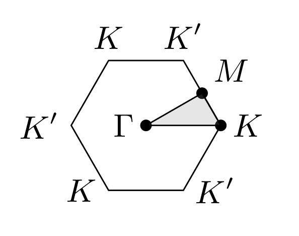

# Graphene 
A tutorial for the calculation of the band structure of graphene via the *density functional theory*  
In this tutorial you will learn how to do the following: 
- define the crystal structure of graphene 
- set up the essential first-principles parameters
- perform a self consistent field calculation 
- test the convergence of total energy with respect to the cut-off energy and the number of k points. 


## Set the path 
All the necessary files are available in `graphene` folder. First change the directory to `graphene`. 
```bash
cd graphene/
```
Then you need to set the path to the root folder of Quantum ESPRESSO on your machine. You can do this by editing the `qe-path` file: 
```bash
#!/bin/sh

QE_PATH=$HOME/code/espresso6.0 # replace with your quantum espresso path
```

## Input files
There are various input files that we use to feed data and parameters to the Quantum ESPRESSO executables. 
Here are the descriptions: 
- `run-graphene`: this is the main `bash` script that we use to run the executables and to set and change the parameters of the calculations. 
- `in/graphene.scf`: the input file related to the *self consistent field* calculations that is used to define the crystal structure and the calculations type and other parameters. The code in this file are mainly in `fortran` language which Quantum ESPRESSO is written in. Therefore, a little bit of familiarity with `fortran` could greatly help in resolving bugs and issues with the input files of this sort.
- `in/graphene.vc`: very similar input file to the `.scf` with the same definition of the crystal structure except for a different type of calculation which is called *variable cell* calculation. 
- `pseudo/`: this folder holds the *pseudo-potential* files which for now we consider them as a smoothed approximation to the real Coulomb potential of the atomic nuclei. We will discuss these in depth in the future. 

**Note**: for a detailed description of input files refer to the Quantum ESPRESSO documentations. You can find them in `PW/Doc/INPUT_PW.html` which is located in the root directory of Quantum ESPRESSO. 

## Define the crystal structure 
To define the crystal structure of graphene you need to know the crystal system and the relative atomic positions. In Quantum ESPRESSO you can easily choose your [*Bravais* lattice](https://en.wikipedia.org/wiki/Bravais_lattice) and other related parameters. The following lines in the `graphene.scf` file in the `&system` section defines the crystal structure. 
```fortran
ibrav = 4           ! index of the Bravais lattice (here a hexagonal lattice)
A = 2.46000000      ! lattice constant in angstrom 
C = 20.00000000     ! vacuum size along the c axis 
nat = 2             ! number of atoms in the unit cell (2 carbon atoms)
ntyp = 1            ! different types of atoms (only 1: carbon)
```
**Note**: since these lines of code are in `fortran` language, the exclamation mark `!` stands for commenting.  
**Note**: The reason that the value for `C` is much larger that the lattice constant is that all the structures in Quantum ESPRESSO are considered periodic. Therefore, to define graphene which is only 1-atom thick and is not periodic in the out of plane direction, we need to introduce a large periodicity. Usually `20` Angstrom is reasonable. 

After defining the crystal structure you will need to determine the `ATOMIC_SPECIES`. 
```fortran 
ATOMIC_SPECIES
 C 12.0106000  $pseudo_c
```
The first entry determines the element carbon. The second entry is the atomic weight which you can find from [NIST](https://www.nist.gov/pml/atomic-weights-and-isotopic-compositions-relative-atomic-masses). The third entry is the name of the pseudo-potential you are using which is located in `pseudo/` folder. Here we use a bash placeholder `$pseudo_c` which is in fact defined in the `run-graphene` file as follows.
```bash
pseudo_c='C.pbe-n-kjpaw_psl.1.0.0.UPF'
```

Next, you need to enter the atomic positions.
```fortran
ATOMIC_POSITIONS {angstrom}
 C 0.00000000 -0.710140831  0.00000000
 C 0.00000000  0.710140831  0.00000000
```
The first entry is the atomic symbol. The next three are the coordinates of the atom in the unit cell in Angstrom units. Graphene has two atoms and each is defined in a separate line. 
**Note**: in the case of graphene the second coordinate `y=0.710140831` of atomic positions is dependent on the lattice constant. In fact, `y = A/(2*sqrt(3))`.


## Set up main parameters
The main parameters that you may want to change at different runs are listed in the beginning of the `run-graphene` file. 
```bash
#!/bin/sh

# parameters
prefix='graphene'                       # used to name output files
pseudo_c='C.pbe-n-kjpaw_psl.1.0.0.UPF'  # pseudo-potential file 
ecutwfc=40.0                            # kinetic energy cutoff
ecutrho=326.0                           # charge density energy cutoff
num_kx=8                                # number of k point along x
num_ky=8                                # number of k point along y
num_kz=1                                # number of k point along z   
num_bands=16                            # number of bands 
```
**Note**: since this file is written in `bash`, the hash symbol `#` is used for commenting.  
**Note**: when defining variables in `bash` there should be no space before and after the equal sign. Therefore, `a = 5` won't work and the correct command is `a=5` with no spaces.  
**Note**: The recommended values of kinetic energy cutoff and the charge density cutoff are usually mentioned in the beginning of the pseudo-potential files.  
**Note**: The three-dimensional k mesh will be of size `num_kx X num_ky X num_kz`


## Perform the self-consistent field calculation 
As you may recall from the *density functional theory*, the Schrodinger's equation depends on an effective potential that depends on the charge density which is the wavefunction squared. Therefore, the Schrodinger equation needs to be solved self consistently. That is what the `scf` calculations does. You can perform this calculation by executing the `run-graphene` script inside the `graphene/` folder.  
```bash
bash run-graphene
```
When the calculation is done you will see `done` in the terminal window. The output of the calculation is written in the following file `out/graphene.scf.out`. This file is usually verbose. Using the following commands you can get the important information about your system quickly. 
```bash
grep -e "\!" out/graphene.scf.out
```
This command gives you the total energy (in Ry units) of the system at the end of self consistent calculations.  

```bash
grep -e "Total force" out/graphene.scf.out
```
This command gives you the total force (in Ry/au units) of the system. 

## Convergence tests 
You can test the convergence of the calculations by redoing the calculations with a different set of parameters and plotting the following.  
1. Total energy vs. kinetic energy cutoff: make sure the total energy converges as the kinetic energy cutoff increases.  
2. Total energy vs. number of k points: make sure the total energy converges as the number of k points increases, e.g., from `4X4X1` to `5X5X1` and etc.  
3. Total energy vs. the lattice constant `A`: does the minimum energy happen for `A=2.46` Angstrom or some other number? Redo the calculations for different values of `A` and see how the energy behaves as a function of `A`.  
**Note**: make sure to update the `y` coordinate of the `ATOMIC_POSITIONS` as you change `A`. 

## Band Structure 
In this section, having done the structural calculations, we try to calculate the band structure of graphene by performing a *non-self-consistent-field* (nscf) calculation followed by a *bands* calculation to find the band dispersion over a k path containing high symmetry points of the Brillouin zone. 

## Non-self-consistent-field calculations 
In order to get accurate band dispersions, one needs to perform band calculations on a relatively denser mesh than the one used in the *self-consistent-field* (scf) calculations. Since, the scf calculations provide us with the effective Kohn-Sham potential, we can use it to calculate the energies over a much denser mesh without the self consistency iterations. The input parameters for the nscf calculation is located in `in/graphene.nscf`. Most of the parameters are and must be the same as in `graphene.scf` file, especially the structural parameters such as the lattice constants and the atomic positions. The only parameters that are different are `calculation = 'nscf'` and `K_POINTS`.  

The nscf tries to read the scf result from the `temp/` folder which contains the wavefunctions in a raw format. Therefore, you need to make sure that the scf calculation is performed before you run the nscf. 
To run the nscf calculation the following commands, in the `run-graphene` file, are executed right after the scf calculations. You will need to run the `bash run-graphene` command in the terminal just like you did for the scf calculations earlier. 

```bash
# nscf calculation
$ECHO "  running the nscf calculation...\c"
# increase the number of k points 
num_kx=16
num_ky=16
num_kz=1
. $IN_DIR/$prefix.nscf
$PW_COMMAND < $prefix.nscf.in > $prefix.nscf.out
check_failure $?
$ECHO " done"
```

**Note**: make sure to use the optimized lattice constant you found earlier in both scf and nscf files.  
**Note**: If you have already done the scf calculations before, you can comment it out.  
**Note**: The nscf might require huge disk memories depending on the number of points in the k space.  


What this code does is that it calculates the wavefucntions over a dense k mesh and stores them in `temp/` and a log of the calculations is stored in `out/graphene.nscf.out` as well. As you can see the number of k points in an nscf calculation is generally larger than that of the scf calculation. While a grid of `16X16X1` might be suitable for band structure calculation, we will see in the future that it might be too coarse for the calculation of the *density of states* and therefore you may want to increase that even further. 


## Bands calculations 
Now we are getting closer to the spaghetti-like band structure. Having done the nscf calculations, we now calculate the bands over a specific k path in the Brillouin zone. The k path that is usually chosen in the case of a hexagonal lattice is `Gamma-K-M-Gamma` which is illustrated below.  

<div align="center"></div>  

A k path that contains high symmetry points in the Brillouin zone can easily be described in Quantum ESPRESSO. The input parameters for *bands* calculations are listed in the `in/graphene.bands` file. Similar to the nscf file, most of the parameters in the bands file, except the `calculation = 'bands'` and the `K_POINTS`, are pretty much the same as the ones in the scf file. The `K_POINTS` are modified as follows  
```fortran
K_POINTS {tpiba_b}
4 
 gG 50
 K 50
 M 50 
 gG 0
```  

The parameter `tpiba_b` means that the k points are defined relative to the primitive vectors of the reciprocal space. The number of high symmetry points `4` must be listed in the beginning. Then the high symmetry points are listed along with a number that determines the number of k points till the next high symmetry point along the k path. Therefore, the total number of k points in the above k path is 150. Also `gG` stands for the Gamma point. 

Now, to perform the bands calculations, you will need to run the following commands, included in the `run-graphene` file. If you have already done the scf and the nscf calculations, you can comment out their corresponding commands. The following code executes the bands calculations.  
```bash
# bands calculation
$ECHO "  running the bands calculation...\c"
. $IN_DIR/$prefix.bands
$PW_COMMAND < $prefix.bands.in > $prefix.bands.out
check_failure $?
$ECHO " done"
```
Remember, to run this script, again you will need to type the `bash run-graphene` in your terminal. The output log is going to be written in `out/graphene.bands.out`. 


## Post processing bands 
There is still one step remaining before you can get the spaghetti plot. Although we do have the eigenvalues and eigenstates of the system over the k path by performing the *bands* calculation, we still need to rearrange and sort the bands. That's what the post processing module does. The input parameters are listed in `in/graphene.post` file. 
The following code in the `run-graphene` file executes the post processing code. 
```bash
# post processing bands 
$ECHO "  post processing the bands...\c"
. $IN_DIR/$prefix.post
$POST_COMMAND < $prefix.post.in > $prefix.post.out
check_failure $?
$ECHO " done"
```
Note that this time we are using the `$POST_COMMAND` instead of the `$PW_COMMAND`. 
As always, first by commenting out the script for the previous calculations and then  typing the following `bash run-graphene` in your terminal you can run the post processing calculations. Finally the output we were looking for is written in `graphene.dat.gnu` which contains the energies of the system in a format suitable for plotting. 

## Plot the band structure 
The band structure can be visualized by plotting the energies listed in the `graphene.dat.gnu` file. A simple *python* script is provided in `plot.py` file. To plot the band structure you only need to run this script in your terminal as follows.  
```bash
python plot.py
```  
This command tries to read the `out/graphene.dat.gnu` file and stores the band structure plot in a pdf file `graphene-bands.pdf` in the same directory. 

## Density of states 
The [density of states](https://en.wikipedia.org/wiki/Density_of_states) describes the distribution of the electronic states over the energy. 
The density of states (DOS) provides a useful way to look at the properties of the system such as the band gap. 
Moreover, *projected* DOS provides information about the spin and orbital compositions of the bands. 
Generally, to calculate the DOS accurately, one needs a dense mesh in the k space since the states need to be integrated over the Brillouin zone. 
In this tutorial, we use a `24X24X1` mesh for the `nscf` calculation but for reliable and accurate results you would usually need more number of points, usually a `48X48X1` or denser mesh. Note that it is always a good idea to test the convergence of the DOS versus the number of the k points.    
**Note**: Usually, for not so much dense meshes you would get spurious oscillations in the DOS plot which can be alleviated by increasing the number of k points. 

To calculate the DOS in Quantum ESPRESSO, first you will need to have performed an `scf` calculation with the typical number of k points, e.g. `8X8X1`. 
Then, by increasing the number of k points, e.g. to `24X24X1`, you perform an `nscf` calculation to get the energies over a dense mesh. 
The last step is to run the `projwfc` command (with `projwfc.x` as the executable) which projects the wavefunction into atomic orbitals and calculates the projected and the total density of states. 
The following codes perform the described tasks.
```bash 
### density of states

# scf calculation
$ECHO "  running the scf calculation...\c"
# reset the number of k points for the scf calculation 
num_kx=16
num_ky=16
num_kz=1
. $IN_DIR/$prefix.scf
$PW_COMMAND < $prefix.scf.in > $prefix.scf.out
check_failure $?
$ECHO " done"

# nscf calculation
$ECHO "  running the nscf calculation...\c"
# increase the number of k points 
num_kx=24
num_ky=24
num_kz=1
. $IN_DIR/$prefix.nscf
$PW_COMMAND < $prefix.nscf.in > $prefix.nscf.out
check_failure $?
$ECHO " done"

# project the wavefunctions 
$ECHO "  Project wave functions...\c"
# set the energy window 
emin=-20.0
emax=10.0
. $IN_DIR/$prefix.projwfc
$PROJ_COMMAND < $prefix.proj.in > $prefix.proj.out
check_failure $?
$ECHO " done"
```  
Here `emin` and `emax` determine the energy window corresponding to the density of states. 
These two parameters along with a few other parameters are listed in the `in/graphene.proj` file. 
The other parameters such as `ngauss` and `degauss` are related to the broadening of the DOS. You can find more information about these in the Quantum ESPRESSO documentation. 
After commenting out the unnecessary parts in the `run-graphene` file and executing it, via `bash run-graphene` in your terminal, the output of the DOS calculation is written in files such as `out/graphene.pdos_...`. 

## Plot the density of states 
The total density of states can be visualized by plotting the data in the `out/graphene.pdos_tot` file. The *python* script in `plot.py` file is modified to perform this task. To plot the density of states you need to uncomment the last two lines of codes  
```python 
fig, ax = plt.subplots(1, 1)
plot_dos_projected(fig, ax, path="out/graphene.pdos_tot", prefix="graphene", fermi=fermi, e_min = -20.0, e_max=10.0)
```  
And then run the following command in your terminal.  
```bash
python plot.py
```  
The density of states is then plotted in a pdf file `graphene-dos.pdf` in the same directory. 
